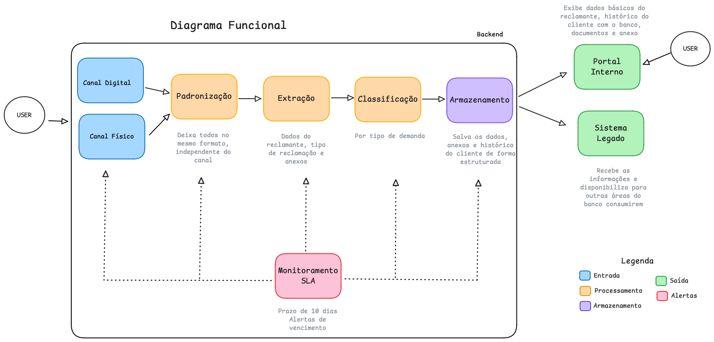
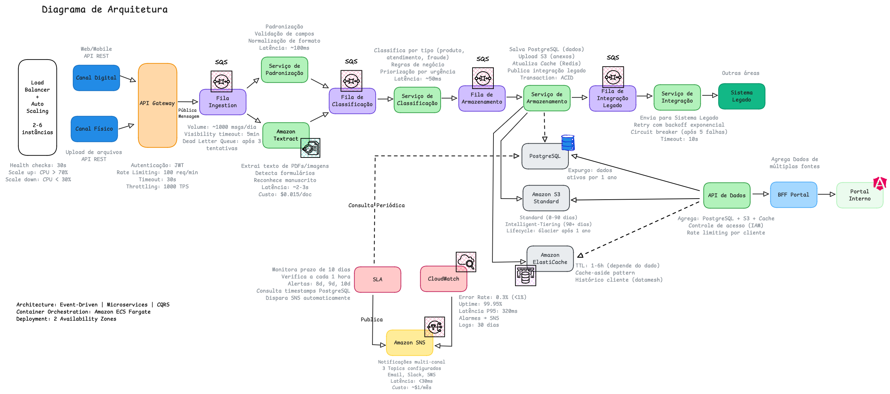

## 📋 Descrição do Desafio

Desenvolver um sistema escalável e resiliente para processar reclamações de clientes recebidas por múltiplos canais (digital e físico), garantindo:

- Processamento de 1.000+ reclamações/dia
- SLA de 10 dias para resolução
- Alta disponibilidade (>99.9% uptime)
- Integração com sistemas legados
- Observabilidade completa

# Sistema de Gestão de Reclamações

Arquitetura event-driven com microserviços para processamento escalável de reclamações bancárias, desenvolvido como desafio técnico.

**Este repositório contém**: Diagramas de arquitetura, respostas do case técnico e implementação do classificador automático de reclamações em C#.

## 💡 Como Resolvi

Estruturei uma arquitetura orientada a eventos com microserviços desacoplados:

- **Filas SQS** para absorver picos e desacoplar serviços
- **Amazon Textract** para OCR de documentos físicos com IA
- **Auto Scaling** para ajustar recursos conforme demanda (2-6 instâncias)
- **Cache Redis** para reduzir latência (80% hit rate)
- **Circuit Breaker** para resiliência na integração com legado
- **CloudWatch + SNS** para monitoramento e alertas progressivos

**Resultado**: Sistema que processa reclamações com custo de $0.005 cada, uptime de 99.95% e latência P95 de 320ms.

## 🏗️ Arquitetura

### Diagrama Funcional

### Diagrama de Arquitetura Técnica

### Padrões Arquiteturais

- **Event-Driven**: Comunicação via filas SQS
- **Microservices**: 5 serviços independentes e escaláveis
- **CQRS**: Separação entre leitura e escrita
- **Circuit Breaker**: Resiliência na integração com sistemas legados
- **Cache-Aside**: Redis com 80% de hit rate

### Fluxo Completo

API Gateway → Fila Ingestion → Processing/OCR →
Fila Classificação → Classification → Fila Armazenamento →
Storage → PostgreSQL + S3 + Redis

## 🚀 Tecnologias

- **C# .NET** - Backend
- **Amazon AWS** - Cloud provider
- **Amazon SQS** - Filas de mensagens
- **PostgreSQL (RDS)** - Banco relacional
- **Amazon S3** - Armazenamento de arquivos
- **Redis (ElastiCache)** - Cache em memória
- **Amazon Textract** - OCR com IA
- **ECS Fargate** - Orquestração de containers
- **CloudWatch + SNS** - Monitoramento e alertas

## ⚙️ Como Executar

> **Nota**: Este repositório contém o **exercício de lógica** que classifica as categorias de reclamações. Para executá-lo localmente, siga os passos abaixo.

### Pré-requisitos

- .NET 8.0 SDK

### Executar a função IdentificarCategoriasDaReclamação

### Clone o repositório

git clone https://github.com/beatriznonato/sistema-gestao-reclamacoes.git

### Entre na pasta do código

cd sistema-gestao-reclamacoes/src

### Compile o projeto

dotnet build

### Execute

dotnet run

### Output esperado:

Categorias encontradas: acesso, aplicativo

## 📊 Métricas do Sistema

| Métrica          | Target | Atual  |
| ---------------- | ------ | ------ |
| Error Rate       | <1%    | 0.3%   |
| Latência P95     | <500ms | 320ms  |
| Uptime           | >99.9% | 99.95% |
| SLA Cumprimento  | >95%   | 98%    |
| Cache Hit Rate   | >75%   | 80%    |
| Custo/Reclamação | <$0.01 | $0.005 |

## 📚 Documentação

- [Requisitos do Sistema](./documentos/requisitos.md)
- [Respostas do Desafio Técnico](./documentos/respostas-case.md)
- [PDF do Case Original](./documentos/case-tecnico.pdf)

## ⭐ Materiais de Referência

Materiais que me ajudaram no desenvolvimento deste projeto:

- [System Design Primer](https://github.com/donnemartin/system-design-primer) - Guia completo de design de sistemas
- [AWS Architecture Best Practices - YouTube](https://www.youtube.com/watch?v=yZfFQpBfEVI) - Práticas recomendadas AWS
- [Microservices Architecture Explained - YouTube](https://www.youtube.com/watch?v=jog_FFD5GVk) - Conceitos de microserviços
